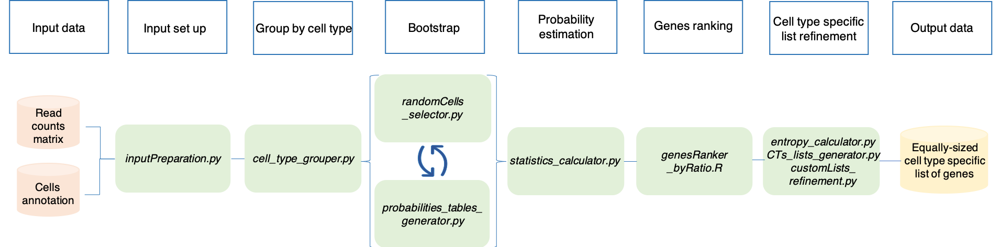
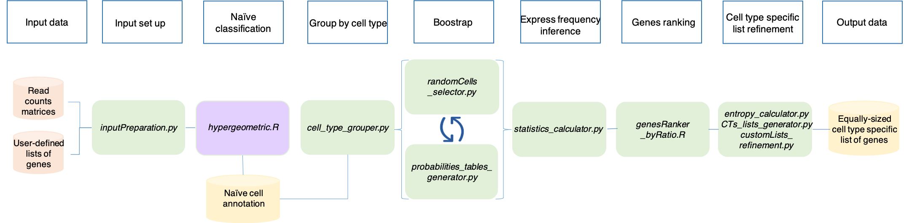

Advanced utilities
==================

SCALT presents other utilities behyond single cell classification:

1. the tool makes use of a scRNA seq read counts matrix and the corresponding **cells annotation** to build series of equally-sized cell type specific lists of genes, one per each cell type present in the annotation, in a deterministic fashion. This method is free of any human interpretation bias and relies on the ground concept on which SCALT is build which is that *each cell type has its own probability of expressing a gene*;
2. the application is also able to build a series of equally-sized cell type specific lists of genes starting from a scRNA seq read counts matrix and a collection of **user-defined lists of genes**, one per each hypothetical cell type. In first place, this method employes the counts matrix and the lists of genes proposed in the input in an **hypergeometric test** to produce a first layer of annotation. The so-called **naive** annotaion. Then, the original counts matrix and the new annotation are used in the same pipeline previously described. 

Workflows
=========

Build the cell-type specific lists of genes starting from annotated data
----------------------------------------------------------------------------

The steps and the relative programs of SCALT are summarized in the following workflow: 

1. **inputPreparation.py** has the role of setting the input files in a format suitable for the pipeline;
2. **cell_type_grouper.py** takes the counts matrix and the annotation table as input and it groups the cells from the matrix on the basis of the annotation;
3. **randomCells_selector.py** randomly selects the same number of cells per each cell type saving them in a new file. The number of cells is dictated by the user;
4. **probabilities_tables_generator.py** uses the previously generate table of cells to infer the probabilities for the current subset of cells. The program estimates 1) the probability for a gene to be expressed in any cell; 2) the probability for a gene to be expressed in any cell type reported in the annotation table;
5. **statistics_calculator.py** estimates the mean probabilites table from the previously tables generated via **boostrap** approach. The latter consists in a recurrent sampling of cells per cell type and consequent probability estimation itertivelly performed a number of times selected by the user. The higher is the number of **boostrap** samples, the higher is the sampling power and consequent accuracy of the probability estimation;
6. **genesRanker_byRatio.R** uses the ratios of the previously calculated probabilities for each cell type and orders them in descending order ranking the genes from the most specific to the least specific for each cell type;
7. **entropy_calculator.py**, **CTs_lists_generator.py** and **customLists_refinement.py** are involved respectivelly in: 1) removal of **housekeeping genes**; 2) generation of the cell type specific lists of genes; 3) refinement of the lists.

Please, follow the next sections of the manual for instructions and tips.

Build the cell-type specific lists of genes starting from user-defined lists
----------------------------------------------------------------------------

The steps and the relative programs of SCALT are summarized in the following workflow: 

The majority of the steps coincide with the generation of the lists starting from an annotation table.

In this case, the annotation table is computed expoiting an **hypergeometric** test that generates a **naive** annotation. The program **hypergeometric.R** takes the counts matrix and the file with the user-defined lists of genes as input. The program considers each cell indipendently and the logic behind is the following. The genes expressed in each cell are collected and tested with each list of genes using an hypergeometric distribution that verifies how likely is to find such intersection between the two list of genes just by chance. The lower is that probability the higher is the confidence behind that annotation. At the end, each cell will be flagged with the annotation with the highest confidence (i.e. lowest FDR). 

Since the other steps of the workflow are identical to the previous pipeline, no further repetions will be added.

Please, follow the next sections of the manual for instructions and tips.
