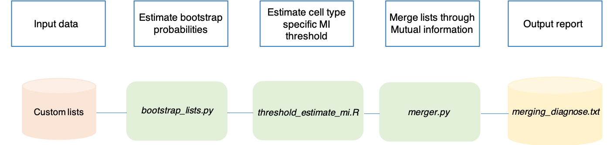

Advanced utilities
==================

SCALT presents other utilities behyond single cell classification:

1. starting from a read counts matrix from single cell RNA sequencing and a corresponding cell annotation table, SCALT builds a series of equally-sized cell type specific lists of genes, one per each cell type present in the annotation, in a deterministic fashion;
2. SCALT ascertain the reliability of the cell type classification used in the previous step quantifying the similariy among the generated lists exploting a method based on **mutual information** that, eventually, underlines which cell types should be organized in a unique operatively-defined cell type.

More details are availble in the manuscript of SCALT.

Workflows
=========

Build the cell-type specific lists of genes starting from annotated data
----------------------------------------------------------------------------

The steps and the relative programs of SCALT are summarized in the following workflow: 

.. figure:: pictures/SCALT_listbuildAnno.png
   :align: center
   :scale: 40% 

1. **inputPreparation.py** has the role of setting the input files in a format suitable for the pipeline;
2. **cell_type_grouper.py** takes the counts matrix and the annotation table as input and it groups the cells from the matrix on the basis of the annotation;
3. **randomCells_selector.py** randomly selects the same number of cells per each cell type saving them in a new file. The number of cells is dictated by the user;
4. **probabilities_tables_generator.py** uses the previously generate table of cells to infer the probabilities for the current subset of cells. The program estimates 1) the probability for each gene to be expressed indipendently from the cell type; 2) the probability for each gene to be expressed in each cell type reported in the annotation table;
5. **statistics_calculator.py** estimates the mean probabilites table from the previously tables generated via **bootstrap** approach. The latter consists in a recurrent sampling of cells per cell type and consequent probability estimation itertivelly performed a number of times selected by the user. The higher is the number of **bootstrap** samples, the higher is the sampling power and consequent accuracy of the probability estimation;
6. **genesRanker_byRatio.R** uses the ratios of the previously calculated probabilities for each cell type and orders them in descending order ranking the genes from the most specific to the least specific for each cell type;
7. **entropy_calculator.py**, **CTs_lists_generator.py** and **customLists_refinement.py** are involved respectivelly in: 1) identification of **variable genes**; 2) generation of the cell type specific lists of genes; 3) refinement of the lists.

Please, follow the next sections of the manual for instructions and tips.

Employ mutual information to quantify cell type similarity
----------------------------------------------------------------------------

The steps and the relative programs of SCALT are summarized in the following workflow: 

1. **bootstrap_lists.py** estimates the probability of finding each gene across a number of bootstrap lists of the same cell type deriving from different number of bootstrap samples. The bootstrap samples are those originated from the **SCALT_annotationListBuilder.py** utility of SCALT. Moreover, it computes the mutual information between each pair of cell type specific list of the same type deriving from each bootstrap sample, excluding self-comparison;
2. **threshold_estimate_mi.R** estimates the threshold of mutual information above which two lists should be merged in a unique one. Specifically, the threshold is the minimum mutual information value observed between two bootstrap lists of the same type;
3. **merger.py** calculates the mutual information between the cell type specific lists of genes in the **custom** input directory using bootstrap probabilies and mutual information threholds derived from the previous steps. The final output is a report highlighting which cell types should be considered as a unique one and the relative similarity measurements expressed in terms of mutual information.

Please, follow the next sections of the manual for instructions and tips.
