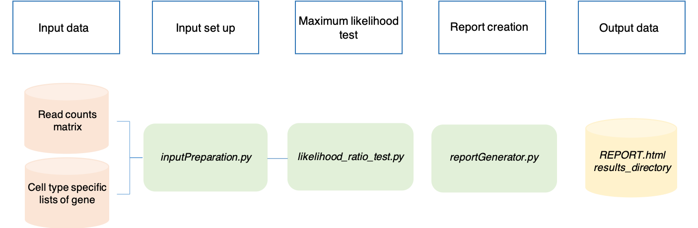

Inputs & Outputs
================

SCALT.py requires a scRNA seq row counts matrix as input data. The matrix must be in **.tsv** extension reporting:

1. genes on the rows;
2. cells on the columns.

The first row of the matrix must contain the ids of each cell while the first column must provide the gene ids written either as **gene symbol** or **ensembl id** (not together). 

.. Note::

   In the case of enesembl gene id, the usage of the version of the id is not allowed. For example, **ENSG00000235430.1** cannot be used in the counts matrix. Use **ENSG00000235430** instead. 

An example of the input file is reported below.

.. list-table::  
   :widths: 50 50 50 50 50 50 50 50 50 50 50 50 50 50 50 50 50 50 50 50 50
   :header-rows: 1

   * - genes/cells
     - 1 
     - 2
     - 3
     - 4
     - 5
     - 6
     - 7
     - 8
     - 9
     - 10
     - 11
     - 12
     - 13
     - 14
     - 15
     - 16
     - 17
     - 18
     - 19
     - 20
   * - ENSG00000160072
     - 0
     - 0
     - 1
     - 5
     - 7
     - 0
     - 0
     - 1
     - 9
     - 0 
     - 10
     - 1
     - 0
     - 11
     - 2
     - 0
     - 0
     - 0
     - 1
     - 1
   * - ENSG00000142611
     - 4
     - 10
     - 0
     - 0
     - 0
     - 0
     - 1
     - 3
     - 1
     - 12
     - 10
     - 1
     - 0
     - 9
     - 7
     - 0
     - 0
     - 0
     - 0
     - 4
   * - ENSG00000157911
     - 0
     - 0
     - 0
     - 0
     - 0
     - 0
     - 0
     - 0
     - 0
     - 0 
     - 0
     - 0
     - 0
     - 0
     - 0
     - 0
     - 0
     - 0
     - 0
     - 0
   * - ENSG00000142655
     - 0
     - 0
     - 0
     - 0
     - 16
     - 14
     - 0
     - 0
     - 0
     - 0
     - 0
     - 0
     - 0
     - 20
     - 0
     - 0
     - 0
     - 0
     - 0
     - 0
   * - ENSG00000149527
     - 1
     - 1
     - 3
     - 2
     - 1
     - 2
     - 0
     - 1
     - 0
     - 5
     - 1
     - 1
     - 0
     - 2
     - 3
     - 1
     - 0
     - 5
     - 1
     - 1

The application returns two outputs:

1. a report file in **.html** format;
2. a directory named **results_directory** hosting a collection of metadata produced upon classification.

The metadata directory lists a series of files which are produced automatically during the classification step and are required for the generation of the report. Among them, we find:

1. **p_values.tsv**, a tabular file reporting a collection of p-values per each cell. Each p-value indicates to a likehood test. Therefore, the number corresponds to the number of cell types tested;
2. **deltas.tsv**, a tabular file reporting a series of likelihood differences between the cell type specific model and the mean cell type. The number corresponds to the number of cell types tested;
3. **originalTables_zipped.zip**, a zipped file containing the original counts;
4. **_adj.tsv** file. Counts table after input set-up performed by SCALT.py by default;
5. **_adj_genesExpressed_filter.tsv** file. Tabular file reporting either **PASS** or **EXCLUDE** if the cell expresses at least the minimum number of genes set in the -Min (or --Threshold) parameter or not;
6. **barplot_cellTypesAboundance.html**, **barplot_survivedCells.html**, **UMAP_2D.html** and **UMAP_3D.html**. Collection of plots visualized in the report file.

SCALT parameters
================

SCALT.py makes usage of a collection of both positional arguments and parameters that can visualized typing the following command:

:: 

  python3 SCALT.py -h

Or:

::

  python3 SCALT --help

The documentation should appear as follows:

::

  usage: SCALT.py [-h] [-Min --Threshold] [-Notation --Notation]
                [-Types --Types] [-CPUs --CPUs]
                Sample

1. **Sample** is the only positional argument of the tool. It represents the scRNA seq counts matrix file;
2. **-Min** or **--Threshold** is the minimum number of genes that a cell must express to be classified. The **default** value is **250**;
3. **-Notation** or **--Notation** is the type of gene notation present in the counts. The defaul is **ensembl id**. Instead, write **gene_symbol** to switch to the gene symbol nomenclature;
4. **-Types** or **--Types** is the name of the directory containg the lists of the cell types to use in the likelihood test. By default, only the pre-compiled lists (DISCO, HPA) are used. To use only the custom lists generated from annotation, insert **custom**. Finally, to utilize only the custom lists generated from the user-defined lists, insert **naive**;
5. **-CPUs** or **--CPUs** is number of processors employed. The default is **1**;
6. **-h** or **--help** shows the documentation.

Run SCALT.py
=========

SCALT.py is quite straightforward sine it requires just the counts table as positional input. 

Leaving default parameters, the basic command appears as follows:

::

   python3 SCALT.py read_counts.tsv

By default, the ensembl id is used. 

If the **gene symbol** is used in the counts matrix, the notation must be specified as follows:

::

   python3 SCALT.py read_counts.tsv -Notation gene_symbol

Or:

::

   python3 SCALT.py read_counts.tsv --Notation gene_symbol

By default, a cell is classified if it expresses at least **250** genes. Managing the SCALT.py parameters, this threshold che be modified as follows:

::

   python3 SCALT.py read_counts.tsv -Min 500

Or:

::

   python3 SCALT.py read_counts.tsv --Threshold 500

In addition, the computational time can be reduced if the number of processors is increased as reported:

::

   python3 SCALT.py read_counts.tsv -CPUs 4

Or:

::

   python3 SCALT.py read_counts.tsv --CPUs 4

Make sure to have available the number of desidered processors in your machine.

To conclude, the different parameters can be modified in a unique call:

::

   python3 SCALT.py read_counts.tsv -Notation gene_symbol -Min 500 -CPUs 4

Or:

::

   python3 SCALT.py read_counts.tsv --Notation gene_symbol --Threshold 500 --CPUs 4

The order of parameters is irrelevant.

Report
======

The report is a file in html format composed of a collection of plots summarizing the general statistics and classification results of the analysis. The file reports four different plots:

1. a bar plot showing how many cells express or not the minimum number of genes for classification;
2. a second barplot counting how many cells were classified to a cell type cathegory;
3. a 2D UMAP;
4. a 3D UMAP.

.. note::
   The genes used for the creation of the UMAPs coordinates are the union of genes coming from the 471 lists of genes without repetitions.

Workflow 
========

Running SCALT.py, the following workflow is performed:

1. **inputPreparation.py** is a python script that adjustes the input counts table in order to be properly analyzed by SCALT.py;
2. **likelihood_ratio_test.py** is the python script that performs the actual likelihood test;
3. **reportGenerator.py** is the python script that creates the final report.

