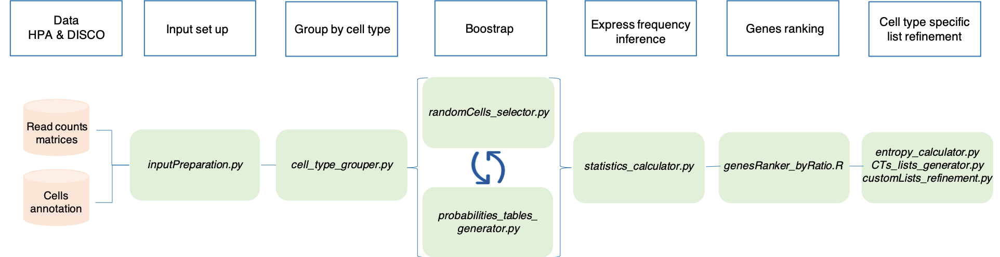

Key point
=========

The ground behind the tool is that each *cell type has its own probability of expressing a gene*. 

Based on that, SCALT leverages a collection of **471** lists of cell-type specific genes, constructed by extensive re-analysis of comprehensive and expert curated catalogues i.e. **Human Protein Atlas** and **DISCO** employing a multi-step pipeline described in the following workflow:

The outcome is a collection of equally-sized lists (100 genes each) containg the cell type specific genes and corresponding inferred probabilities.

Human Protein Atlas (HPA)
=========================

The **Human Protein Atlas** is a database that integrates multiple omics information including single cell RNA sequencing (scRNAseq) data from 31 human tissues together with peripheral blood mononuclear cells (PBMCs).

The extensive re-analysis of the database involved **689602** cells from **31** tissues classifed in **81** cell types generating a collection of **81** cell type specific lists of genes with respective probabilities and presenting the same number of genes reporting small level of overlap.

DISCO 
=====

The **DISCO** database is a database of **Deeply Integrated Single-Cell Omics data**. The current release of DISCO integrates more than 18 million cells from 4593 samples, covering 107 tissues/cell lines/organoids, 158 diseases, and 20 platforms.

**4900170** cells from **24** tissues classified in **430** cell types were utilized for the creation of **430** cell type specific lists of genes with respective probabilities. Again, the lists have the same number of genes and report a small level of overlap even for closely related cell types.

