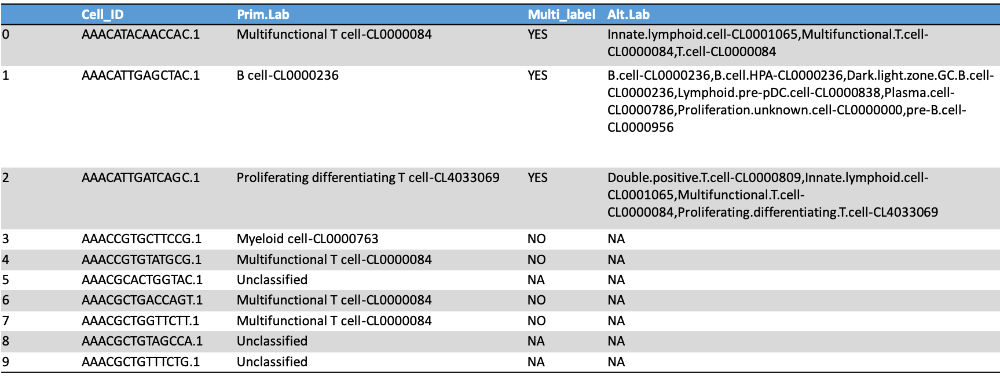

PBMCs tutorial 
==============

The tutorial consist in analyzing a sample of perifieral blood mononuclear cells (PBMCs) from Fu and colleagues. You can find the corresponding article at the following `link <https://doi.org/10.1093/bib/bbae392>`_. 
The database is already available at the Github repository of SCARLET (SCARLET/tutorial_dataset/Liu_PBMCs.tsv.zip)
Once obtained a file in tsv format, the only command needed to run SCARLET is the following:

::

   python3 SCARLET.py Liu_PBMCs.tsv -Notation gene_symbol  

The output consists in a series of files and metadata table that should provide a complete picture of the composition of cells present in the sample according to SCARLET.
SCARLET generates two outputs: a report in HTML format and a tabular file. The peculiarity of the report is that it is interactive and allows a user to play around the results.
The report generated from the Liu dataset can be visualized at the following `link <https://danitrave.github.io/SCARLET/tutorial_dataset/Liu_PBMCs_report.html>`_. 
Please, follow step by step the following paragraphs to have a clear description of each plot.

.. note::

   When running the tutorial, you might find different colors associated to the different cell types. It is totally normal since, each time, SCARLET assigns colors randomly when is executed.

Survived cells barplot
----------------------
The first plot in the report is a barplot reporting the number of cells that survived the initial expression filter. In brief, a cell is annotated as **unclassified** if it does not express a minimum number of genes (by defaul 250).

Cell type aboundance barplot
----------------------------
The second plot is another barplot showing the relative aboundance of each cell type annotated by SCARLET, including **unclassified** and **multiassigned** cells.

UMAP 2-dimensions
-----------------
Next, SCARLET organize cells in a 2D-UMAP, coloring them according to the realtive annotation assigned. The genes used for the calculation of the coordinates are those of the cell types that managed to annotate at least 50 cells. 

UMAP 3-dimensions
-----------------
In the forth plot, SCARLET reports the same information previously described but visualized in 3 dimensions.

UMAP 2-dimensions - cell ontologies
-----------------------------------
Finally, the last picture present in the report is a UMAP in 2 dimensions where cells are colored depending on the cell ontology instead of the annotation of SCARLET.

Cell annotation table
---------------------
The second major output of SCARLET is a tabular file in tsv format highlighting the classification outcome assigned to each cell by the tool. 
A piece of the table reporting the results for the first 10 cells of the 3K PBMCs sample is reported below.

1. **Cell_ID** is the barcode of each cell;
2. **Prim.Lab** indicates which was the most significant annotation according to SCARLET. When none of the lists recapitulates the cell type, the annotation found in this column is **unclassified**;
3. **Multi_label** notifies when a cell is annotated as **multiassigned** or not. Three cases are possible. If the cell is multiassigned, the corresponding value in this column will be **YES**. Wherever the cell is univocally assigned, the value will be **NO**. Finally, if the cell is unclassified, its value in this column will be **NA**;
4. **Alt.Lab** shows the significant possible annotations when a cell is multiassigned. In the other cases, the value is NA.

