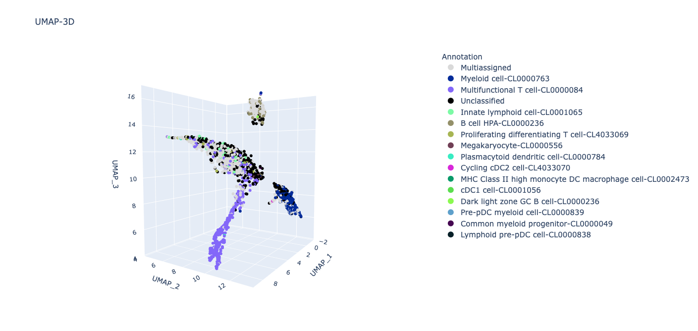

PBMC 3K tutorial
================

The tutorial consist in analyzing a sample of perifieral blood mononuclear cells (PBMCs) that can be downloaded from the Seurat vignette available at the following `link <https://satijalab.org/seurat/articles/pbmc3k_tutorial>`_. 
Make sure to convert counts from a 10X to a tsv format.

Once obtained a file in tsv format, the only command needed to run SCALT is the following:

::

   python3 SCALT.py countsPBMC3K.tsv -Notation ensembl_id  

The output consists in a series of files and metadata table that should provide a complete picture of the composition of cells present in the sample according to SCALT.
The first file is a **report** in html format comprehensive of series of pictures reported below.

Survived cells barplot
----------------------
This barplot repors the number of cells that survived the initial expression filter that annotates a cell as **unclassified** is it does not a minimum number of genes (by defaul 250).

Cell type aboundance barplot
----------------------------
The following barplot shows the relative aboundance of each cell type annotated by SCALT, including **unclassified** and **multiassigned** cells.

UMAP 2-dimensions
-----------------
The plot reported below is a UMAP in 2 dimensions depicting the cells and their relative annotation acording to SCALT. The genes used for the calculation of the coordinates are those of the cell types that managed to annotate at least 50 cells. 

UMAP 3-dimensions
-----------------
The following UMAP reports the same information previously described but visualized in 3 dimensions.

UMAP 2-dimensions - cell ontologies
-----------------------------------
Finally, the last picture present in the report is a UMAP in 2 dimensions where cells are colored depending on the cell ontology instead of the annotation of SCALT.

