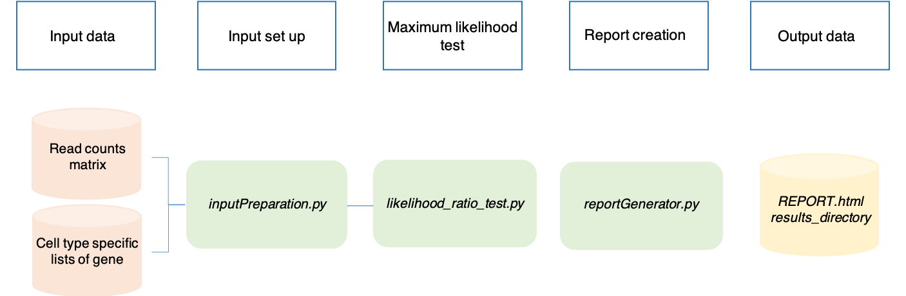
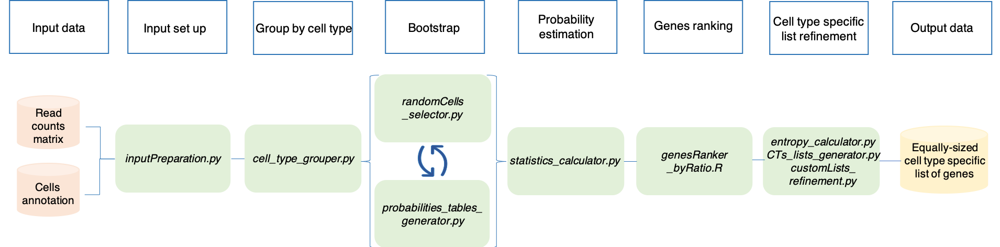

SCALT tools
===========

SCALT integrates three different pipelines for the analysis of single cell RNA sequencing data indicated by the following three programs:

1. **SCALT.py**;
2. **SCALT_AnnotaionListsBuilder.py**;
3. **SCALT_NaiveListsBuilder.py**.

SCALT: classification
=====================

**SCALT.py** utilizes the pre-compiled cell type specific lists of genes originated from DISCO and Human Protein Atlas (HPA) database to classify cells from a scRNA seq counts matrix indipendently one from the others and without any kind of clustering or dimension reduction. 

A general workflow of the utility can be visualized in the following image:

SCALT: lists building from annotation
=====================================

**SCALT_AnnotaionListsBuilder.py** makes use of a scRNA seq read counts matrix and the corresponding cells annotation to build series of equally-sized cell type specific lists of genes, one per each cell type present in the annotation, in a deterministic fashion.

The following picture reports a general workflow of the pipeline:

SCALT: lists building from user-defined lists
=============================================

**SCALT_NaiveListsBuilder.py** requires a scRNA read counts data and series of user-defined lists of genes, one per each potential cell type. The tool exploits an **hypergeometric test** and the lists of genes to generate a *naive annotation* of cells. The latter and the original counts matrix are utilized to build series of equally-sized cell type specific lists of genes, one per each cell type present in the naive annotation, in a deterministic fashion.

Here the general workflow is reported:

.. figure:: pictures/SCALT_listsbuildNaive.png
   :align: center
   :scale: 40%
